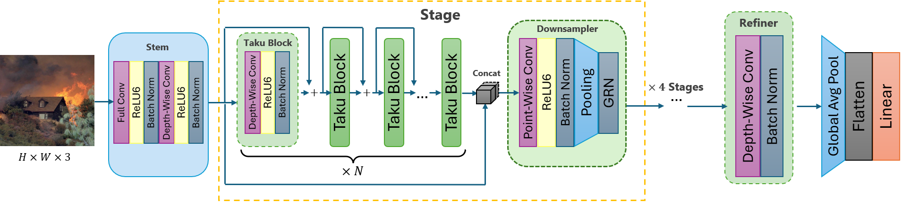
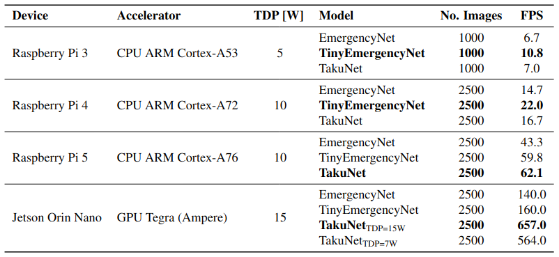

<div align="center">

# __TakuNet__: an Energy-Efficient CNN for Real-Time Inference on Embedded UAV systems in Emergency Response Scenarios

[Daniel Rossi](https://personale.unimore.it/rubrica/dettaglio/239210), [Guido Borghi](https://personale.unimore.it/rubrica/dettaglio/gborghi), [Roberto Vezzani](https://personale.unimore.it/rubrica/dettaglio/rvezzani)

University of Modena and Reggio Emilia, Italy

### [ArXiv](https://arxiv.org/abs/2501.05880) · [CVF](https://openaccess.thecvf.com/content/WACV2025W/V3SC/papers/Rossi_TakuNet_an_Energy-Efficient_CNN_for_Real-Time_Inference_on_Embedded_UAV_WACVW_2025_paper.pdf)

<div align="center">



</div>

</div>

## Table of Contents 🔑
1. [Introduction](#introduction)
2. [Installation](#installation)
3. [Usage](#usage)
4. [Inference Scripts](#inference-scripts)
   - [Single Image Inference](#single-image-inference)
   - [Batch Image Inference](#batch-image-inference)
5. [Inference on Edge Devices](#inference-on-edge-devices)
6. [Additional Information](#additional-information)
7. [Citation](#citation)
8. [License](#license)


## Introduction 🎙
TakuNet is a convolutional architecture designed to be extremely efficient when deployed on embedded systems. Extensive experiments on [AIDER](https://arxiv.org/pdf/1906.08716) and [AIDERV2](https://openreview.net/forum?id=8UgKEVu7up) demostrate that TakuNet is able to achieve near-state-of-the-art accuracy while being extremely efficient in terms of number of parameters, memory footprint and FLOPs among the competitors.

<div align="center">



</div>

A deeper inspection on models performance on a few embedded devices such as Raspberry Pis and NVIDIA Jetson Orin Nano show that TakuNet can achieve a very large speedup in terms of Frame per Second against competitors, mostly on recent embedded architectures.
Since TakuNet is trained with float-16 resolution, its optimization through TensorRT on NVIDIA hardware accelerator does not approximate the model weights.

## Installation ⌨️
TakuNet code exploits docker container to simplify code distribution and execution on different devices and hardware architectures. If you have already installed docker on your machine, you can skip the docker setup step.

This work was developed on a Ubuntu-24.04.1-LTS-based system with NVIDIA Drivers 560.35.03, equipped with an Intel i5 8600K, 16GB DDR4 2666MHz, NVIDIA RTX 3090 24GB. Training were performed on a different machine, composed of an Intel i7 12700F and NVIDIA RTX 4070ti Super.
On the other hand, experiments on Raspberry Pi(s) were conducted through the docker container running on Raspbian Bookworm, while NVIDIA Jetpack 6.1 was installed on the Jetson Orin Nano Devkit device. 

### Docker setup 🚢
1. Install docker on a Linux based machine possibly
    ```
    wget https://get.docker.com/ -O get_docker.sh
    chmod +x get_docker.sh
    bash get_docker.sh
    ```
2. Once docker has been installed, install [nvidia-docker](https://docs.nvidia.com/datacenter/cloud-native/container-toolkit/latest/install-guide.html) for GPU support
    ```
    curl -fsSL https://nvidia.github.io/libnvidia-container/gpgkey | sudo gpg --dearmor -o /usr/share/keyrings/nvidia-container-toolkit-keyring.gpg \
    && curl -s -L https://nvidia.github.io/libnvidia-container/stable/deb/nvidia-container-toolkit.list | \
    sed 's#deb https://#deb [signed-by=/usr/share/keyrings/nvidia-container-toolkit-keyring.gpg] https://#g' | \
    sudo tee /etc/apt/sources.list.d/nvidia-container-toolkit.list
    ```
    update and install the nvidia container tool
    ```
    sudo apt-get update
    sudo apt-get install -y nvidia-container-toolkit
    ```
    configure nvidia container toolkit
    ```
    sudo nvidia-ctk runtime configure --runtime=docker
    sudo systemctl restart docker
    ```
3. Add required permissions to your user in order to perform actions with docker on containers
    ```
    sudo groupadd docker
    sudo usermod -aG docker $USER
    newgrp docker
    ```

### Repository setup 📂
1. Clone the repository
    ```
    git clone https://github.com/DanielRossi1/TakuNet.git
    ```
2. Build the docker container
    ```
    cd TakuNet/docker
    ./build.sh
    ```
3. Once the container has finished to build, run it. the run script supports directory mount through arguments. Directories are mounted in `/home/user/... `
    ```
    # Just run the container
    ./run

    # run the container and mount a directory (e.g. the one which contains the dataset). Here you will find AIDER in /home/user/AIDER
    ./run -d /home/your-username/path-to-data/AIDER
    ```

### Required Python Packages 📦
For standalone installations without Docker, ensure you have the following Python packages installed:

```bash
pip install torch torchvision opencv-python matplotlib numpy pillow
```

## Usage 🧰
The execution interface is really simple, it consists of a bash script which launches the main.py script, automatically loading the arguments and configurations specified in TakuNet's configuration file: `configs/TakuNet.yml`.
```
cd src
./launch.sh TakuNet
```

### Configuration file parameters ⚙️:
<details>
  <summary>Base Settings</summary>

- **num_epochs** (_int_): Total number of training epochs
- **batch_size** (_int_): Batch size used for training
- **seed** (_int_): Random seed set for training and testing
- **experiment_name** (_str_): Name of the folder that will be created for the training, or sourced for testing. It will be created in `src/runs/`. Multiple runs over the same experiment name will overwrite logs.
- **main_runs_folder** (_path_): Here you specify the train and test output path
- **pin_memory** (_bool_): Torchvision dataloader pin memory
- **mode** (_Train/Test/Export_): You can choose to train, test, or export the model in ONNX format

</details>


<details>
  <summary>Logging</summary>

- **tensorboard** (_bool_): Whether to use TensorBoard for logging
- **wandb** (_bool_): Whether to use Weights and Biases (wandb) for logging
- **gradcam** (_bool_): enable GradCam for gradient flow inspection
</details>

<details>
  <summary>Dataset and Data loading</summary>

- **num_workers** (_int_): Number of threads used by the dataloader
- **persistent_workers** (_bool_): torchvision dataloader persistent workers
- **dataset** (_AIDER/AIDERV2_): Specifies the dataset, and in particular the dataloader, to be used
- **data_path** (_path_): The path where the actual dataset is stored on your docker container (e.g. `/home/user/Data/AIDER`)
- **num_classes** (_int_): Number of output classes of the model. AIDER has 5 classes while AIDERV2 has 4 classes of different images.
- **img_height** (_int_): Images are resized by default, this sets the height.
- **img_width** (_int_): Images are resized by default, this sets the width.
- **augment** (_bool_): Enables or disables data augmentation
- **k_fold** (_int_): Number of folds for k-fold cross-validation. Works only on AIDER since AIDERV2 has its own stand-alone validation set.
- **split** (_proportional/exact_): Defines how to split the AIDER dataset. `proportional` follows the same proportions used in the EmergencyNet paper, while `exact` creates a test set of equal size to the one used in the latter.
- **no_validation** (_bool_): If set to false, does not create a validation set for AIDER

</details>

<details>
  <summary>Pytorch Lightning Precision</summary>

- **lightning_precision** (_16-mixed/32-true_): 16-bit floating point mixed precision or 32-bit floating point precision

</details>

<details>
  <summary>Model settings</summary>

- **network** (_str_): 'TakuNet' is the only available model
- **input_channels** (_int_): Number of channels of the input images, default is 3 for RGB
- **dense** (_bool_): Enables or disables dense connections in TakuNet
- **ckpts_path** (_str_): Path of the checkpoints to be used in inference (filename included)

</details>


<details>
  <summary>Optimization parameters</summary>

- **optimizer** (_str_): Which optimizer to be used in training (available: `adam`, `adamw`, `sgd`, `rmsprop`)
- **scheduler** (_str_): Learning rate schedulers used in training (available: `cosine`, `cyclic`, `step`, `lambda`). These are set in `src/networks/LightningNet.py`
- **scheduler_per_epoch** (_bool_): Update the learning rate at the end of each epoch
- **learning_rate** (_float_): Initial learning rate
- **learning_rate_decay** (_float_): Decay used by schedulers
- **learning_rate_decay_steps** (_float_): Decay steps used by schedulers
- **min_learning_rate** (_float_): Minimum learning rate value
- **warmup_epochs** (_int_): Learning rate warmup epochs
- **warmup_steps** (_int_): Learning rate warmup steps
- **weight_decay** (_float_): Weight decay used by the optimizer
- **weight_decay_end** (_float_): Uses the same scheduler as learning rate, thus this set the min value
- **update_freq** (_int_): Update frequency for training steps
- **label_smoothing** (_float [0,1]_): Sets label smoothing for cross-entropy loss
- **model_ema** (_bool_): Whether to use model exponential moving average
- **alpha** (_float_): Alpha value for RMSprop
- **momentum** (_float_): Momentum value for RMSprop and SGD
- **class_weights** (_list of float_): Class weights to be used in cross-entropy loss

</details>

<details>
  <summary>Export</summary>

- **onnx_opset_version** (_int_): set onnx opset version for exported model

</details>

## Inference Scripts 🔮

TakuNet provides two different inference scripts for evaluating the model on test images:

### Single Image Inference

The `singleimage_inference.py` script allows you to process individual images and visualize the results.

**Usage:**
```bash
python src/singleimage_inference.py --image path/to/image.jpg --checkpoint src/ckpts/TakuNet_AIDERV2.ckpt --visualize
```

**Arguments:**
- `--image` (required): Path to the input image
- `--checkpoint` (required): Path to the model checkpoint
- `--width` (optional, default=224): Image width for processing
- `--height` (optional, default=224): Image height for processing
- `--visualize` (optional flag): Display visualization of results

**Example with included checkpoints:**
```bash
# Process a single image from the Test directory using the AIDERV2 checkpoint
python src/singleimage_inference.py --image src/Test/Flood/image_265.png --checkpoint src/ckpts/TakuNet_AIDERV2.ckpt --visualize

# Process a single image using the AIDER checkpoint
python src/singleimage_inference.py --image src/Test/Fire/image_123.png --checkpoint src/ckpts/TakuNet_AIDER.ckpt --visualize
```

The script will output the predicted disaster class and confidence scores for each category (Earthquake, Fire, Flood, Normal).

### Batch Image Inference

The `batch_image_inference.py` script processes multiple images from test directories, creates visualizations, and compiles them into a video.

**Usage:**
```bash
python src/batch_image_inference.py --checkpoint src/ckpts/TakuNet_AIDERV2.ckpt --test_dir src/Test --output_dir predictions_results
```

**Arguments:**
- `--test_dir` (optional, default='src/Test'): Directory containing test images organized in class folders
- `--checkpoint` (required): Path to the model checkpoint file
- `--output_dir` (optional, default='predictions_results'): Directory to save results
- `--num_images` (optional, default=20): Number of random images to select
- `--width` (optional, default=224): Image width for processing
- `--height` (optional, default=224): Image height for processing

**Example with included checkpoints:**
```bash
# Process 20 random images using the AIDERV2 checkpoint
python src/batch_image_inference.py --checkpoint src/ckpts/TakuNet_AIDERV2.ckpt --test_dir src/Test --output_dir predictions_results

# Process 50 random images using the AIDER checkpoint
python src/batch_image_inference.py --checkpoint src/ckpts/TakuNet_AIDER.ckpt --test_dir src/Test --output_dir predictions_results --num_images 50
```

**Test Data Structure:**
The repository includes a test dataset organized in the `src/Test` directory with the following structure:
```
src/Test/
  ├── Earthquake/
  │   └── [earthquake images]
  ├── Fire/
  │   └── [fire disaster images]
  ├── Flood/
  │   └── [flood disaster images]
  └── Normal/
      └── [non-disaster images]
```

**What the script does:**
1. Randomly selects images from the test directory across all disaster class folders
2. Processes each image through the TakuNet model
3. Creates visualizations showing:
   - The original image with true and predicted labels
   - A bar chart of confidence scores for each class
4. Saves individual visualizations to the output directory
5. Compiles all visualizations into an MP4 video for easy viewing
6. Calculates and displays accuracy statistics

**Understanding the Results:**
After running the batch inference script, you'll find the following in your output directory (default: `predictions_results`):

1. **Individual Result Images**: Files named `result_XXX.png` contain:
   - Left side: Original image with true class and predicted class labels
   - Right side: Bar chart showing confidence scores for each class
   
2. **Video Summary**: `results_video.mp4` compiles all visualization images into a single video file for easy viewing and sharing

3. **Console Output**: Displays a summary of the processing including:
   - Number of images found and processed
   - Accuracy metrics (percentage of correctly classified images)

**Available Checkpoints:**
The repository includes two pre-trained model checkpoints:

1. `src/ckpts/TakuNet_AIDER.ckpt`: Model trained on the AIDER dataset
2. `src/ckpts/TakuNet_AIDERV2.ckpt`: Model trained on the AIDERV2 dataset (recommended)

## Inference on Edge Devices 🔋
Embedded device inference scripts are located in the `embedded` folder, and require a proper configuration for each specific target device. The main configuration file is located in `embedded/configs/TakuNet.yml`. 
```
cd src
python3 embedded/main.py --cfg-path embdedded/configs/TakuNet.yml
```

<details>
  <summary><b>Inference configuration parameters ⚙️</b></summary>
The inference script has to adapt based on the target execution device. Thus you need to properly set a few parameters before launching the main script. 
<ul>
 <li><b>onnx_model_path</b>: where the exported onnx file is located</li>
 <li><b>engine_model_path</b>: where to store the TensorRT engine</li>
 <li><b>use_tensorrt</b>: wether to enable TensorRT, to be used only on Jetson devices (set to false on Raspberry Pi)</li>
 <li><b>fp16_mode</b>: true if your ONNX model is half-precision, else false if it has been exported with float-32 precision</li>
 <li><b>dataset_size</b>: test are conducted on randomly generated images (Torchvision FakeData) since we only want to measure inference speed. We set a number of images equal to 2600 and we drop the first 100 to compensate for the warm-up time</li>
 <li><b>img_size</b>: specifies the shape of the image (AIDER and AIDERV2 have different image shape)</li>
 <li><b>num_classes</b>: must be the same number of classes used during model training</li>
 <li><b>batch_size</b>: size of the batch of images to be processed in parallel (default 1)</li>
 <li><b>old_jetpack</b>: This option allows the model to be optimized using TensorRT on older Jetson devices. <i>Since this process is not straightforward, it may still encounter issues or errors. However, we encourage you to try it and report any issues you encounter.</i></li>
</ul>
</details>

## Additional Information 🔍

<details>
  <summary><b>TensorRT Export</b></summary>

To properly export a model exploiting TensorRT optimization, you need to set `use_tensorrt: true` in `embedded/config/TakuNet.yml`. The optimization should take place on the hardware device and requires onnx checkpoints to be already exported. 

You may face some issues when trying to compress the model through TensorRT on older Jetson devices such as _NVIDIA Jetson Nano (Maxwell)_ or _NVIDIA Jetson TX1_. In such cases, we suggest to lower the ONNX opset version, and set `old_jetpack: true` during inference. 
</details>

<details>
  <summary><b>Performance on Edge Devices</b></summary>
Embedded devices require a stable input voltage to operate effectively. Improper use of power supplies, including unsuitable cables, may result in degraded and unstable performance. In some cases, such misuse could potentially cause permanent damage to the devices.

To maximize the performance of embedded devices, it is recommended to stop any application or service that may interfere with their operation. These can introduce unnecessary overhead or cause resource contention, potentially impacting the efficiency and responsiveness of the devices.

For optimal performance with TakuNet, we recommend performing a fresh OS installation. Furthermore, active termal cooling should be installed (if not already present) to avoid thermal throttling.
</details>

<details>
  <summary><b>Troubleshooting Common Issues</b></summary>

- **Missing Python Libraries**: If you encounter errors about missing libraries, install them using pip:
  ```bash
  pip install torch torchvision opencv-python matplotlib numpy pillow
  ```

- **Path Resolution Problems**: When running the batch inference script, make sure your directory paths are correct. If you're running from the root directory of the project, use `src/Test` for the test directory. If you're already in the `src` directory, use just `Test`.

- **CUDA/GPU Issues**: If you encounter CUDA-related errors, check that your GPU drivers are up-to-date and that PyTorch is installed with CUDA support. You can check this with:
  ```python
  import torch
  print(torch.cuda.is_available())
  ```

- **Visualization Not Working**: If visualizations aren't displaying properly, ensure matplotlib is correctly installed and that you're using a non-interactive backend when running in environments without a display:
  ```python
  import matplotlib
  matplotlib.use('Agg')  # Use non-interactive backend
  ```
</details>

## Citation 📝

If you find this code useful for your research, please consider citing:

```bibtex
@InProceedings{Rossi_2025_WACV,
    author    = {Rossi, Daniel and Borghi, Guido and Vezzani, Roberto},
    title     = {TakuNet: an Energy-Efficient CNN for Real-Time Inference on Embedded UAV systems in Emergency Response Scenarios},
    booktitle = {Proceedings of the Winter Conference on Applications of Computer Vision (WACV) Workshops},
    month     = {February},
    year      = {2025},
    pages     = {376-385}
}
```

## License 📜

This project is licensed under the [Creative Commons Attribution-NonCommercial-ShareAlike 4.0 International License (CC BY-NC-SA 4.0)](https://creativecommons.org/licenses/by-nc-sa/4.0/).

### Summary of Terms
- **Attribution (BY)**: You must give appropriate credit to the original author(s), provide a link to the license, and indicate if changes were made.
- **NonCommercial (NC)**: This work may not be used for commercial purposes.
- **ShareAlike (SA)**: If you remix, transform, or build upon this work, you must distribute your contributions under the same license as the original.

For the full legal text of the license, please refer to [https://creativecommons.org/licenses/by-nc-sa/4.0/legalcode](https://creativecommons.org/licenses/by-nc-sa/4.0/legalcode).

### Commercial Use
If you are interested in using this work for commercial purposes, please contact us.